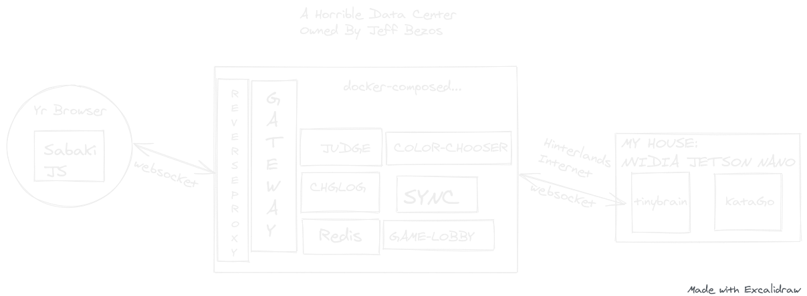

# BUGOUT

🐛 Play Go against your friends, over the web! 🕸

🤖 _Or play against KataGo AI_ on a power-efficient dev board! 🤖

Want to play right now? Click here: [go.terkwood.farm](https://go.terkwood.farm)


## Design

- Allows play against AI using [KataGo](https://github.com/lightvector/KataGo), running on an [NVIDIA Jetson Nano](https://developer.nvidia.com/embedded/jetson-nano-developer-kit) and consuming a mere 5W of power.
- Backend powered by [Redis](https://redis.io/).
- Uses a descendant of [Sabaki](https://sabaki.yichuanshen.de/) for the [web UI](browser/).
- A [public-facing websocket gateway](gateway/README.md) communicates with the browser.



## 🛑 STOP! Potential developers, please read carefully.

_BUGOUT is not suitable for playing KataGo on your workstation._

The production version of BUGOUT relies on an instance of KataGo hosted on an NVIDIA Jetson Nano, compiled with ARM architecture. KataGo is spawned by the [tinybrain](./tinybrain/README.md) process.

These services run _in my home_, and connect remotely to an AWS-hosted instance serving the rest of the system. This requires a websocket connection, and a valid SSL certificate.

### If your goal is to play KataGo on your home computer...

...then we suggest trying out [KaTrain](https://github.com/sanderland/katrain), which works flawlessly. It has a lovely UI, it will download and set up KataGo for you, and it will save your valuable time.

#### Why isn't BUGOUT better?

Mainly because we designed this system with the goal of being playable over the web. For this purpose, it functions well enough.

In our context, the build of KataGo itself [probably isn't reproducible](./tinybrain/README.md). At least, getting it set up to run in the current production system was a bit of a pain point.

#### Are you still interested in trying to run this system locally?

If so, _don't say we didn't warn you!_

### Building the distributed monolith (everything but KataGo)

BUGOUT uses docker to host multiple images, including a reverse-proxy for web traffic, and a redis instance. You need to create directory which will be used for volume mounting these instances. Inside the reverse-proxy directory, you'll need a `Caddyfile`, which this script will also create:

```sh
sh admin/setup-local-dev.sh
```

BUGOUT relies on [docker-compose](https://docs.docker.com/compose/install/) to run _most_ of its services. It will invoke some buildkit-related options, so please use the included script to start the system.

```sh
sh compose.sh up
```

If you're hacking BUGOUT, you will want to host the
web application on your local machine. You need to [install
npm](https://docs.npmjs.com/downloading-and-installing-node-js-and-npm). Then:

```sh
cd browser
npm install
npm run build
npm run start
```

### Building KataGo

The tinybrain utility currently does not use docker-compose. This utility wraps [KataGo](https://github.com/lightvector/KataGo)
AI and allows it to communicate with the rest of the backend services. We run it using a [systemd script](./tinybrain/tinybrain.service).

We have some [poorly written notes](./tinybrain/README.md) about building KataGo, but they are _specific to NVIDIA Jetson Nano + ARM_. You're on your own if you want to get everything hooked up via x86_64.

[We don't currently have a path for you to connect KataGo + tinybrain to the rest of your system, locally](https://github.com/Terkwood/BUGOUT/issues/473).
